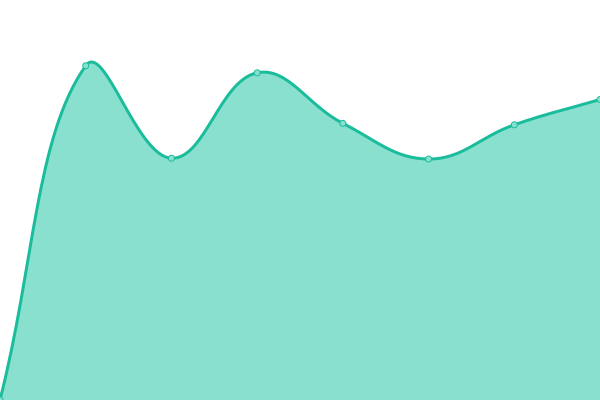
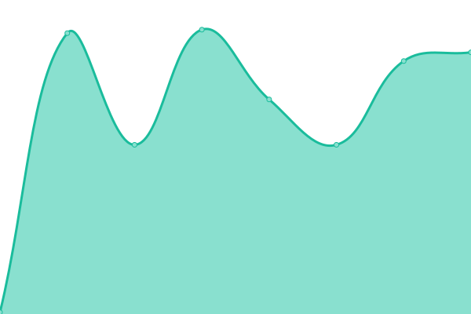

# [📈 Live Status](https://digitalservice4germany.github.io/agora-uptime): <!--live status--> **🟧 Partial outage**

This repository contains the open-source uptime monitor and status page for [DigitalService](https://digitalservice.bund.de), powered by [Upptime](https://github.com/upptime/upptime).

With [Upptime](https://upptime.js.org), you can get your own unlimited and free uptime monitor and status page, powered entirely by a GitHub repository. We use [Issues](https://github.com/digitalservice4germany/agora-uptime/issues) as incident reports, [Actions](https://github.com/digitalservice4germany/agora-uptime/actions) as uptime monitors, and [Pages](https://digitalservice4germany.github.io/agora-uptime) for the status page.

<!--start: status pages-->
<!-- This summary is generated by Upptime (https://github.com/upptime/upptime) -->
<!-- Do not edit this manually, your changes will be overwritten -->
<!-- prettier-ignore -->
| URL | Status | History | Response Time | Uptime |
| --- | ------ | ------- | ------------- | ------ |
|  [Agora](https://agora-oegd.de) | 🟩 Up | [agora.yml](https://github.com/digitalservicebund/agora-uptime/commits/HEAD/history/agora.yml) | 

 2207ms
     
 | 

<a href="https://digitalservicebund.github.io/agora-uptime/history/agora">100.00%</a>
    

|  Forum | 🟩 Up | [forum.yml](https://github.com/digitalservicebund/agora-uptime/commits/HEAD/history/forum.yml) | 

 949ms
     
 | 

<a href="https://digitalservicebund.github.io/agora-uptime/history/forum">100.00%</a>
    

|  Wiki | 🟩 Up | [wiki.yml](https://github.com/digitalservicebund/agora-uptime/commits/HEAD/history/wiki.yml) | 

 1730ms
     
 | 

<a href="https://digitalservicebund.github.io/agora-uptime/history/wiki">100.00%</a>
    

|  Collabora | 🟥 Down | [collabora.yml](https://github.com/digitalservicebund/agora-uptime/commits/HEAD/history/collabora.yml) | 

 527ms
     
 | 

<a href="https://digitalservicebund.github.io/agora-uptime/history/collabora">0.00%</a>
    

|  Nutzer:innenverwaltung | 🟩 Up | [nutzer-innenverwaltung.yml](https://github.com/digitalservicebund/agora-uptime/commits/HEAD/history/nutzer-innenverwaltung.yml) | 

 124ms
     
 | 

<a href="https://digitalservicebund.github.io/agora-uptime/history/nutzer-innenverwaltung">100.00%</a>
    

<!--end: status pages-->

[**Visit our status website →**](https://digitalservice4germany.github.io/agora-uptime)

## 📄 License

- Powered by: [Upptime](https://github.com/upptime/upptime)
- Code: [MIT](./LICENSE) © [DigitalService](https://digitalservice.bund.de)
- Data in the `./history` directory: [Open Database License](https://opendatacommons.org/licenses/odbl/1-0/)
